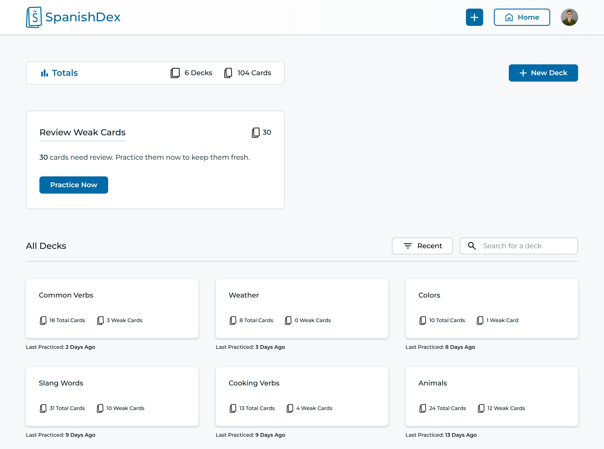

<!-- Title of the Project -->
# SpanishDex Flashcards Web Application

<br>

<figure>
 <p>
  
  <i>SpanishDex Dashboard</i>
 </p>
</figure>

<br>
 
⚠️ **Notice**: This application is still currently in the development phase. See the [Figma Prototype](https://www.figma.com/proto/3fpV6gGIeCu5xWYL131f1m/SpanishDex?node-id=526-6854&node-type=canvas&viewport=255%2C203%2C0.3&t=Zm7Bkl52VzJ6oVi6-0&scaling=min-zoom&content-scaling=fixed&starting-point-node-id=526%3A6854) to get a glimpse at what's to come.

<br>


<!-- ABOUT THE PROJECT -->
## About The Project

SpanishDex is a flashcards web application. This application is built specifically for Spanish learners as a place to store and practice new vocabulary words. It uses a spaced learning algorithm to remind users to practice their vocabulary, allowing learners to retain Spanish words longer.

### Built With

- **Next.js**
- **Bootstrap**
- **MongoDB**

### Interactive Prototype!

This application is still in the development phase. If you want to see what the application will look like, please take a look at the prototype.
I created the prototype in Figma. It is high-quality, and I put a lot of effort into making it *interactive*. Check it out!

[Figma Prototype](https://www.figma.com/proto/3fpV6gGIeCu5xWYL131f1m/SpanishDex?node-id=526-5542&node-type=canvas&viewport=255%2C203%2C0.3&t=Zm7Bkl52VzJ6oVi6-0&scaling=min-zoom&content-scaling=fixed&starting-point-node-id=526%3A6854)

### Project Vision (features)
 - Have a homepage describing the purpose of the application and pointing the user to sign up or log in.
 - Give the users and option to contact the website owner with a form right on the homepage.
 - Provide two sign up or log in options:
   - Authenticate with a username and password.
   - Authenticate with Google OAuth.
 - Allow the users to reset their password if they forgot. 
 - Have a dashboard with a list of the user's flashcard decks along with some statistics
 - Ability to create flashcards and make decks to store the flashcards
 - Have a page for each flashcard deck. This pages lists the flashcards in the deck and gives the user the option to listen to the Spanish word's pronunciation
 - Be able to edit and delete flashcards and decks
 - Allow the user to practice flashcards:
   - They could practice all their weak words contained in all their decks. (Weak words are determined by a spaced repetition algorithm. More details below)
   - They could practice all the weak words of an individual deck.
   - They could aslo practice all the words of an individual deck.
 - Have an account page where the user can edit their username, email, password and profile picture.

### Project Status (completed features)
 - The homepage is fully completed including the functionality of the contact form.
 - Authentication is implemented
   - I used Auth.js for authentication, utilizing the Credentials and OAuth providers
   - User accounts are stored in MongoDB
   - Users can log out and log in seamlessly.
 - Users can now reset their password.
   - First they enter their email into a form.
   - An email is sent to their inbox with a link that is used to reset their password.
   - I use Sendgrid to send emails for password resetting.

### Spaced Learning Algorithm
This application will use a spaced learning algorithm to determine when a word is considered "weak" or, in other words, needs to be practiced.
When a user is practicing flashcards, SpanishDex asks the user, on a scale from 1 to 5, how well they did in guessing the definition of the word. SpanishDex uses this information to determine when the word should be practiced again.
</br></br>
Other factors used to determine this include:
- The score history for the card
- The last time the card was practiced
- Whether the word was practiced on time or not


<br>

<!-- GETTING STARTED -->
## Install Locally

If you want to get a local copy of this project up and running, follow these example steps.

### Prerequisites

#### NPM
To run this locally, you will first need npm.
Run this command to verify its installation:
  ```sh
  npm -v
  ```

#### MongoDB
You will need MongoDB to run this app correctly.
You have two options:
 1. Install MongoDB locally. [Download MongoDB](https://www.mongodb.com/try/download/community). Follow [this guide](https://www.mongodb.com/docs/manual/tutorial/install-mongodb-on-windows/#run-mongodb-community-edition-as-a-windows-service) for more information.
 2. Use MongoDB Atlas. [Get Atlas](https://www.mongodb.com/products/platform/atlas-database?tck=docs_mongosh)

#### Sendgrid (optional)
If you want this app to be able to send emails (password reset emails), you will first need a Sendgrid account. [https://sendgrid.com/](https://sendgrid.com/) Then, you will need to create an API key (you will use this later).

#### Google OAuth (optional)
In order to sign in or sign up with Google OAuth, you will need to set up OAuth in your Google Developers Console. [http://console.developers.google.com/](http://console.developers.google.com/). You can follow [this article](https://blog.rebex.net/howto-register-gmail-oauth) to set it up or find a different one that works better for you. The important details are the **client ID** and **client secret** which you will get once you've set up OAuth. You will need these two pieces of information later.

### Installation

1. Clone the repo
   ```sh
   git clone https://github.com/JakinCS/SpanishDex.git
   ```
2. Switch to the correct directory by running:
   ```
   cd .\SpanishDex\
   ```
3. Install NPM packages
   ```sh
   npm install
   ```
4. Add environment variables
   - Create a ```.env.local``` file in the root directory of the application.
   - Add the **MONGODB_URI** environment variable. Set it equal to mongodb://localhost:27017 (using the default port) if you are running MongoDB locally.
     ```
     mongodb://localhost:27017
     ```
     If you are using MongoDB Altas, set it equal to the connection URI (this is found in the connection instructions for the database cluster). It will look like this:
     ```
     mongodb+srv://<USERNAME>:<PASSWORD>@cluster0.<appId>.mongodb.net/<DBNAME>?retryWrites=true&w=majority
     ```
   - Add the **APP_URL** environment variable. Set it equal to the URL from which the application is run. For a local installation it is simply: ```http://localhost:3000```
   - Add the **AUTH_SECRET** environment variable. Set it equal to a random value.
     You can generate it with this command: ```openssl rand -base64 32```, or use this link: [https://generate-secret.vercel.app/32](https://generate-secret.vercel.app/32)
   - Add the **AUTH_TRUST_HOST** environment variable. Set it equal to 'true'. This variable will ensure that Auth.js works with builds on localhost
   - Add the **SENDGRID_API_KEY** environment variable (optional). If you created a Sendgrid account, set this equal to the API key you created earlier.
   - Add the **CONTACT_EMAIL** environment variable (optional). Again, this is only if you set up Sendgrid. Set this variable equal to your email. This will be the receiving email of any messages sent through the contact form on the homepage or contact modal.
   - Add the **AUTH_GOOGLE_ID** environment variable (optional). If you decided to set up Google OAuth, then you will need to put the client ID here.
   - Add the **AUTH_GOOGLE_SECRET** environment variable (optional). Set this equal to the client secret.
5. Run the application
   ```sh
   npm run dev
   ```

<br>

<!-- USAGE EXAMPLES -->
## Usage

Navigate to [spanishdex.vercel.app](https://spanishdex.vercel.app) to use the production version of the application on the web.
<br/>
If you are running this application locally, navigate to [localhost:3000](http://localhost:3000) (or similar).


<br>

<!-- CONTRIBUTING -->
## Contributing

This project is open source. Any contributions you make are **greatly appreciated**.

If you have a suggestion that would make this better, please fork the repo and create a pull request. Otherwise, you can simply open an issue and tag it with the tag "enhancement".

1. Fork the Project
2. Create your Feature Branch (`git switch -c feature/NewFeature`)
3. Commit your Changes (`git commit -m 'Added an improvement'`)
4. Push to the Branch (`git push origin feature/NewFeature`)
5. Open a Pull Request


<br>

<!-- LICENSE -->
## License

Distributed under the MIT License. See `LICENSE.txt` for more information.


<br>

<!-- CONTACT -->
## Contact

Jakin Stahl - [LinkedIn](https://www.linkedin.com/in/jakinstahl/) - jakinstahl@gmail.com

Project Link: [github.com/JakinCS/SpanishDex](https://github.com/JakinCS/SpanishDex)


<br>

<!-- ACKNOWLEDGMENTS -->
## Acknowledgments

* [Article - Spaced Repetition Algorithm](https://freshcardsapp.com/srs/write-your-own-algorithm.html)
* [README Template by Othneil Drew](https://github.com/othneildrew/Best-README-Template)


